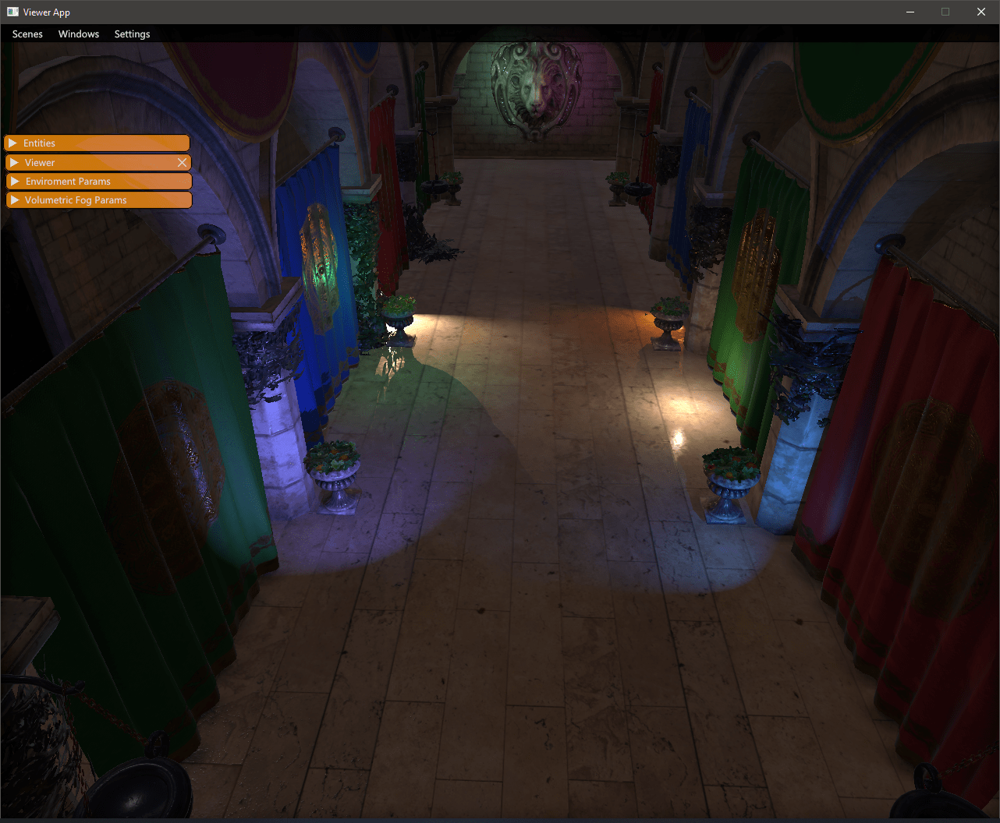
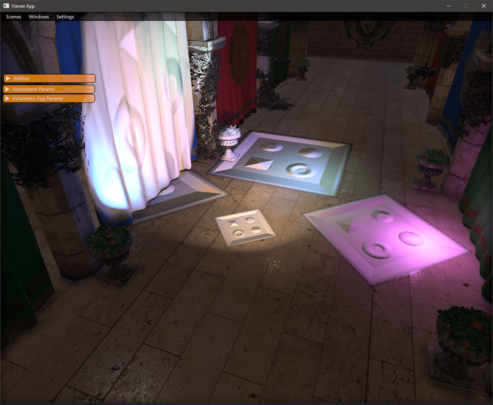
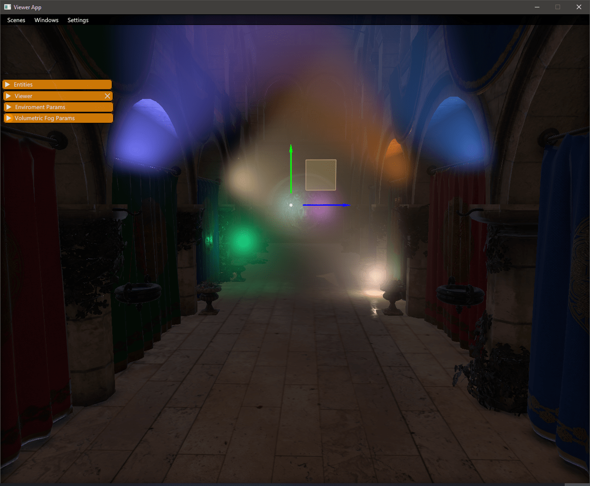
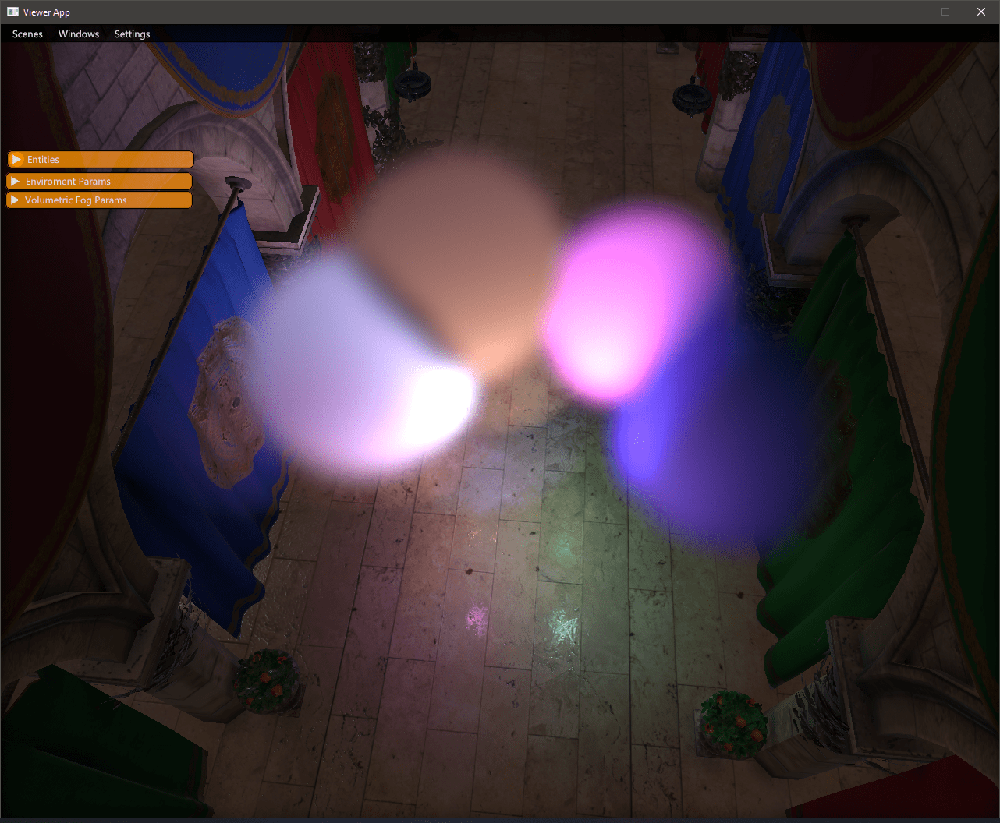
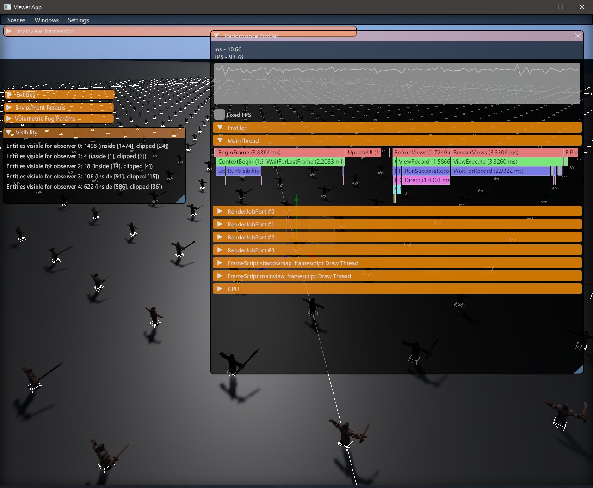

# Nebula engine   

Get in contact on Discord! https://discord.gg/wuYPxUF

Check out the documentation (WIP) here: https://gscept.github.io/nebula-doc/

## Requirements
1. OS: Windows and Linux (WIP)
2. Compiler with support for C++20.
3. GPU and drivers supporting Vulkan 1.2+
4. [CMake 3.21+](https://cmake.org/download/)
5. [Python 3.5+](https://www.python.org/downloads)
    * Python requirements (Windows):
        1. Matching architecture (64-bit if you're building for 64-bit systems)
        2. Installed for all users
        3. Added to PATH
        4. Installed with debugging symbols and binaries

#### Other useful references and tools
* [Vulkan SDK](https://vulkan.lunarg.com/) and [Vulkan Documentation](https://docs.vulkan.org/) for render pipeline debugging
* [What is Fips](https://floooh.github.io/fips/)

## Quick Start

The fastest way to setup and test nebula is to clone the [Nebula-demo](https://github.com/gscept/nebula-demo) instead. It contains a setup.bat which will setup dependencies and configure a 
solution for you to run via `fips open`. 
Alternatively you can build and run the project manually with `fips build`, `fips run assetbatcher` and `fips run nebula-demo --`. If you add a `-editor` commandline argument it will start with the editor ui enabled. 
Apart from that there are a few simple projects in the test folder. 
Fips will take care of getting the relevant dependencies (including the actual engine in case you are setting up a external project)

## Normal setup
If you want to proceed with the normal setup you can follow the instructions below. 
Proceed to the project iteration section afterwards. 

#### Setup config

1. `fips set config win64-vstudio-debug` in your project directory, e.g. the cloned nebula-demo. There are other configs available, see in fips-files/configs
2. `fips fetch` Downloads/checks out all the other required repositories

#### Select the project and source directory

Run `fips nebula` verb to set work and toolkit directory registry variables:

  * `fips nebula set work {PATH}` (If you are building an external project, this would be the current path)
  * `fips nebula set toolkit {PATH}` (this is the path to where the nebula checkout resides, if an external project that would be `../nebula`)

#### Build project dependencies

In your project directory:
  
  1. `fips physx build vc17 debug` (if you are running VS 2022, use `vc16` or `vc15` for vs 2019/2017 instead)
  2. `fips anyfx setup`

## Iterating on the project
Once the project is set up and working there are some common operations that you may have to perform.
Most of the steps and operations are required to be completed at least once to be able to run the project.

### Adding files – `fips gen`
If you are adding new files, either source or templates or other flatbuffer things that you add to cmake or a cmake subfolder will typically picked up by running `fips gen`. This will regenerate your solution via cmake, in case you are using visual studio it will normally 
notice and prompt reloading. Generally calling `fips gen` is a safe operation you can do if dependencies change etc.

#### Location of build files
Fips will place the solution and makefiles and the like in the `../fips-build/{PROJECT-NAME}/{CONFIG}/` folder. Easiest is to just use `fips open` to start your editor

### Updating dependencies – `fips update`
The project you are working in is commonly synced with e.g. git or some other version control, if you have other fips dependencies that changed, you can do a `fips update` to perform a git pull on the depencies used.

### Compiling the project – `fips build`
(Re-)Building the project is possible either via the generated solution (`fips open` to open it quickly) or manually with `fips build`.

### Dealing with content – `fips run assetbatcher --`
Content is usually batched using the `assetbatcher` contained in the nebula repository which is built by default by projects as well. Running it will incrementally convert or cook content in your `work` folder to an export folder in the project location. It has a number of options to force or only batch specific folders, as well as 
the option to be run in parallel. Running it with `-help` will print some of the options available.

## Running the project
To run the debug project without editor tools, use `fips run {PROJECT-NAME}` or run a debug session in your solution opened with `fips open`. Use `fips run {PROJECT-NAME} -- -editor` to run the project with editor ui enabled. 

## Features
Nebula is being developed continuously, which means that features keep getting added all the time. Currently, we support this:

* Completely data-driven design from bottom to top.
* Data structure suite, from containers to OS wrappers, everything is designed for performance and minimal call stacks.
* Multithreading.
* SSE-accelerated and intuitive maths library.
* Full python supported scripting layer.
* Advanced rendering framework and shaders.
* Test-benches and benchmarking.
* Profiling tools.

#### Rendering
A lot of effort has been made to the Nebula rendering subsystem, where we currently support:

* Unified clustering system - fog volumes, decals and lights all go into the same structure.
* Screen-space reflections - working condition, but still work in progress.
* Horizon-based ambient occlusion done in compute.
* Physically based materials and rendering.
* Multi-threaded subpass recording.
* Shadow mapping for local lights and CSM for global/directional/sun light.
* Volumetric fog and lighting.
* Geometric decals. 
* CPU-GPU hybrid particle system.
* Skinning and animation.
* Scripted rendering path.
* Vulkan.
* Tonemapping.
* Asynchronous compute.
* Virtual texturing using sparse binding.
* Adaptive virtual textured terrain.
* Fast and conservative GPU memory allocation.
* Area lights.

#### Entity system
Nebula has historically had a database-centric approach to entities.
With the newest iteration of Nebula, we've decided to keep improving by adopting an ECS approach, still keeping it database-centric.

* Data-oriented
* Data-driven
* Minimal memory overhead per entity.
* High performance without compromising usability or simplicity
* Blueprint and template system for easily instantiating and categorizing entity types.
* Automatic serialization and deserialization

## Screenshots
Deferred Lighting using 3D clustering and GPU culling.

Geometric decals, culled on GPU and rendered in screen-space.

Volumetric fog lighting.

Local fog volumes.

Profiling tools.

